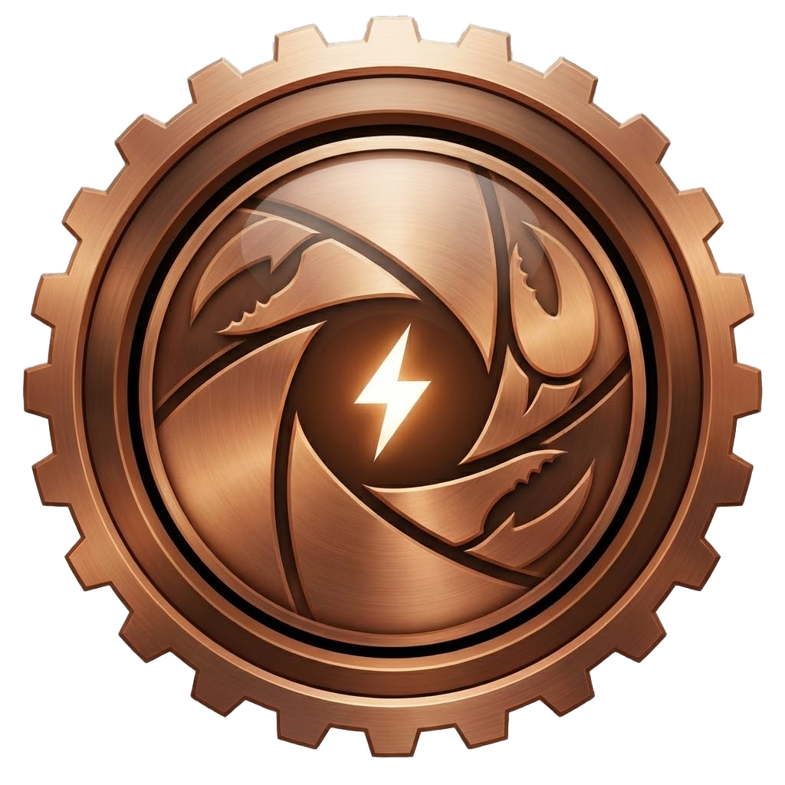

# rsnap

<p align="center">
  
</p>

A native Windows tray app for screenshotting, markup, and screen recording across arbitrary desktops — including mixed-DPI, multi-monitor layouts.

## Features

- **Region capture across monitors.** Drag out a selection spanning any combination of monitors (any resolution, DPI scale, or arrangement), or click a window to capture it whole.
- **Markup**, drawn directly on the captured region:
  - Freeform draw, highlighter, box, circle, arrow, text, and sequential numbered badges
  - Blur and invert-colors region tools
  - Magic Erase (paints over content with the color sampled from the stroke's start point)
  - Undo/redo, adjustable color and stroke width
- **Output**: copy to clipboard, Save As via a native dialog, autosave to a configurable folder, or pin the screenshot to a floating always-on-top window.
- **Screen recording** of a selected region: pause/resume, a native marching-ants border while recording, and a floating action dock to stop/copy/save the finished video (MP4 or AVI).
- Lives in the system tray with a global capture hotkey (default `Ctrl+Shift+PrtScn`) and a Settings window for hotkeys, output locations/formats, default markup style, and recording parameters.

## Install

Download the latest release from the [Releases](https://github.com/adamrpostjr/rsnap/releases) page:

- **`rsnap-setup.exe`** — an installer (built with [NSIS](https://nsis.sourceforge.io/)) that installs rsnap per-user to `%LOCALAPPDATA%\Programs\rsnap`, adds a Start Menu shortcut, and registers a normal uninstaller (no admin rights required).
- **`rsnap.exe`** — the portable binary on its own; just run it, no install needed. It puts an icon in your system tray.

Or build from source (below).

## Build from source

Requires a recent stable Rust toolchain ([rustup.rs](https://rustup.rs)) on Windows 10/11.

```
cargo build --release
```

The resulting binary is at `target/release/rsnap.exe`.

To also build the installer, install [NSIS](https://nsis.sourceforge.io/) and run:

```
makensis installer.nsi
```

which produces `rsnap-setup.exe`.

## Usage

- Press the capture hotkey (default `Ctrl+Shift+PrtScn`, configurable in Settings) or use the tray icon's "Capture" menu item.
- Drag out a region, or click a window to select it outright.
- Pick a markup tool from the toolbar that appears once a region is selected, then Copy, Save, Pin, or Record.
- Right-click the tray icon for Settings, Stop Recording, or Quit.

## Configuration

Settings are stored at `%APPDATA%\rsnap\config.toml` and are editable via the tray menu's Settings window. Errors that would otherwise have nowhere to go (this is a windowless GUI app with no console) are appended to `%APPDATA%\rsnap\rsnap.log`.

## Platform

Windows 10/11 only — built directly on Win32, Windows Graphics Capture, and Media Foundation. There are no plans to support other platforms.

## Attribution

Toolbar icons are from [Lucide](https://lucide.dev), used under the ISC license — see [`assets/icons/LICENSE`](assets/icons/LICENSE).

## License

[MIT](LICENSE) © Adam Post
